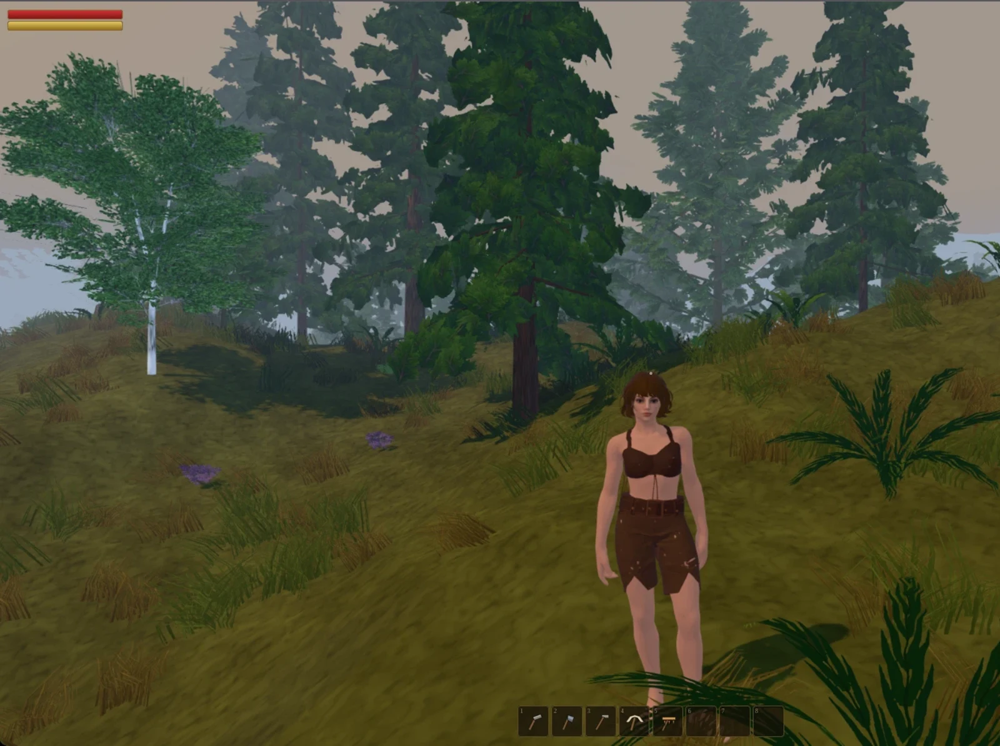
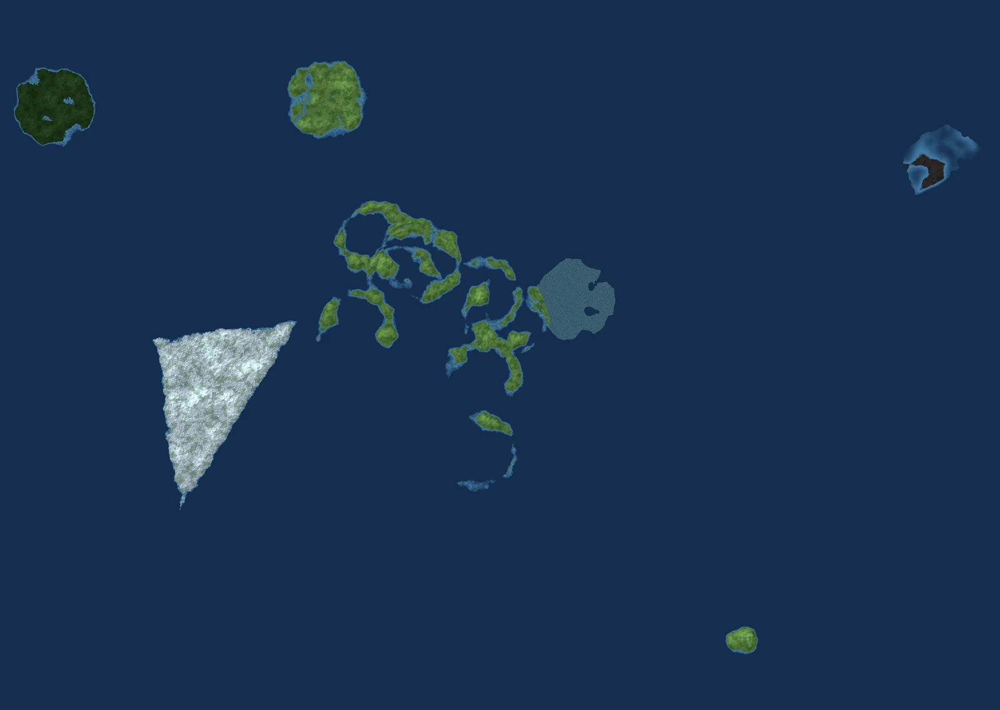
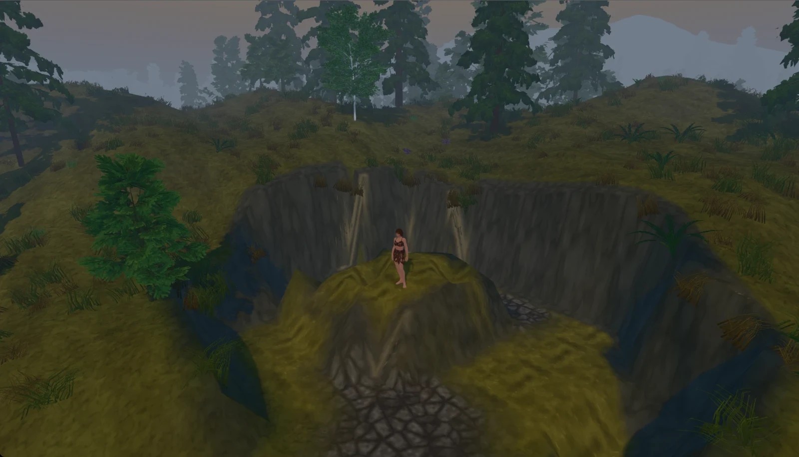
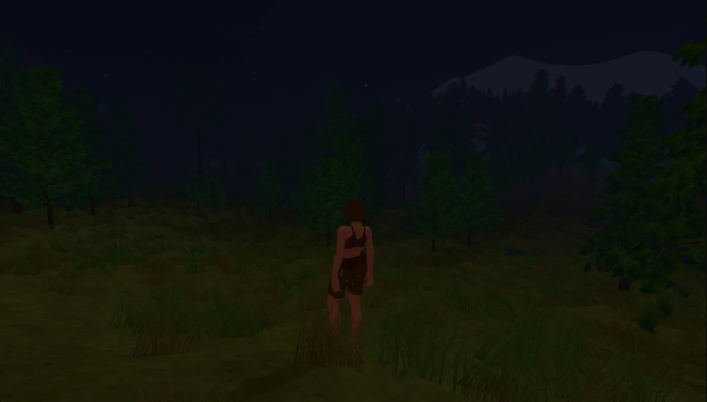
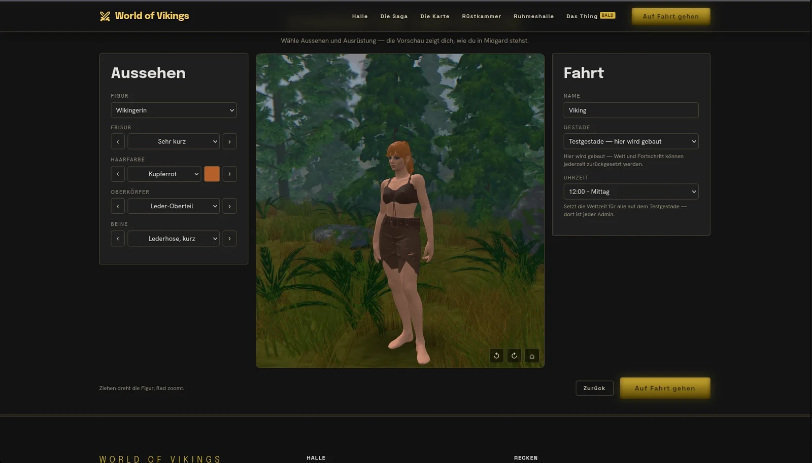
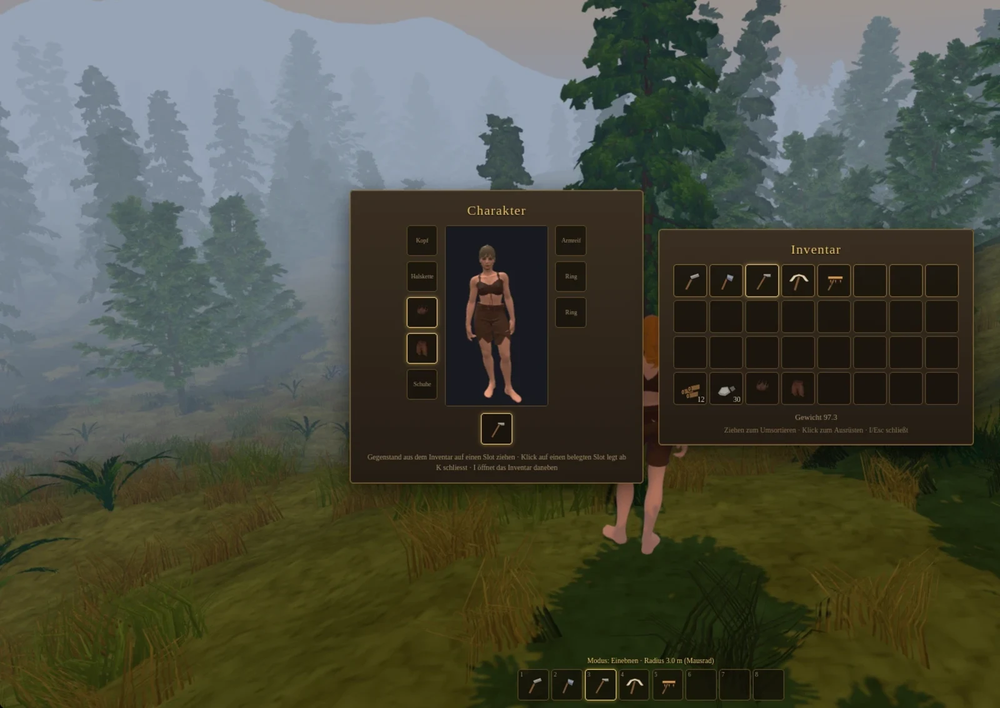

# World of Vikings

**A browser MMORPG: Anglo-Saxons against Vikings. Meadows, black forest and swamp — no
download, no launcher, no patch day.**

Open a tab, create a character, walk into a world that keeps running after you close it. The
client is Babylon.js, the server is authoritative TypeScript, and both sides share one
deterministic world generator.



> ### This project is entirely vibe coded
>
> Every line of the server, the client, the shared world generation, the tools and this
> document was written by an AI (Claude), who directs the work,
> decides, measures and rejects. That is not a footnote — it is the method the thing is built
> with, and the commit history is its record: the messages carry the reasoning, the numbers and
> what got refuted along the way.

---

## What it is

**The world is designed, not rolled.** It comes out of a *world document*: regions as polygons
and circles on an unbounded map, each with a biome and its terrain parameters. Everything
outside them is ocean. The in-game editor writes that document, the server compiles it into a
distance field, and the Perlin detail *inside* a region comes from the biome height functions.
The live world currently holds 17 curated regions.



**The server has the say.** Movement, inventory, crafting and building costs, terraforming and
loot are decided server-side. The client draws and asks; it never asserts. World generation
lives in `shared/` and runs identically on both sides — deterministic, and pinned bit-for-bit
by golden tests, because a client that computes a different hill than the server is a client
that falls through the ground.



The terrain is not scenery. Digging and levelling are server-side operations on the height
field, and what one player carves out stays carved out for everyone.



**Everything you see is self-made.** Models, textures, sounds — no foreign material anywhere in
the world or the game content. The allowlist is `EIGENE_MODELLE` in `shared/src/prefabs.ts`,
`istEigenesModell()` is the check, 145 entries at the moment. Whatever is not on it gets
filtered out of the tables rather than rendered as a placeholder.

## Where it stands

Characters are created on the website, before the game is even loaded. The preview runs the
same Babylon build as the client, bundled out of this repository, so the figure standing in the
browser is the one that walks into the world.



**Running today** — walking, running, jumping, swimming · day and night · weather and fog,
steerable from the server · character creation with two body types, 38 hairstyles, 18 beards and 12 hair colours ·
equipment slots as a paperdoll, with clothing as real inventory items · inventory, chests,
crafting · terraforming with hoe and cultivator · attack on the left mouse button, weapon or
fist · multiplayer with zone-based replication · world editor, world map, chat.



**Switched off on purpose** — building, creature combat, locations and dungeons. Those systems
are built and tested; they are off in `server/data/server.yml` because the models they would
place are not self-made yet. Of the hammer's nine build pieces, two have one.

That is a deliberate intermediate state, not a defect: the game waits for its own models
instead of borrowing any. Turning them back on is a config change plus the missing assets, not
a rewrite. The world itself stands and is walkable.

## Under the hood

**Client** — Babylon.js with WebGPU and a WebGL2 fallback, thin instances for vegetation, Havok
physics, cascaded shadow maps, per-pixel directional fog, a grass layer that follows the
terrain, and a terrain streamer that builds chunks across several frames against a shared time
budget, so a new zone never costs a dropped frame.

**Server** — TypeScript, a ZDO model for replicated objects, zone-based interest management, a
binary WebSocket protocol, and the save game as a zstd-compressed JSON envelope written
atomically.

**Shared** — world generation, item and recipe tables, the protocol, the lists for appearance
and equipment. One source for both sides; every list that exists twice drifts apart, and this
project has paid for that often enough to stop doing it.

**Tests** — 68, run by GitHub Actions on every push together with typecheck and lint. They are
written to fail for a reason: quite a few exist because one particular bug got through once and
is not going to get through twice.

## Running it

```bash
npm ci
npm run dev
```

The client then serves on port 5274, the game server listens on 2467.

```bash
npm run typecheck
npm run lint
npm test
```

## Documentation

`Docs/` holds the reasoning, not just the result — why Babylon, how the world document works,
what the graphics concept measures, how dungeons generate. The documents are German, and so is
most of the existing source: identifiers, comments and the older commits. Development switched
to English on 2026-08-23, from there on rather than retroactively.

| | |
|---|---|
| [00 — Master plan](Docs/00-Master-Plan.md) | Target picture and overall structure |
| [01 — Why Babylon.js?](Docs/01-Warum-Babylon.md) | The engine decision |
| [02 — Where the client came from](Docs/02-Herkunft-des-Clients.md) | From the first prototype to today's engine |
| [03 — Rendering and engine](Docs/03-Rendering-und-Engine.md) | Client internals |
| [04 — Asset pipeline](Docs/04-Asset-Pipeline.md) | How models and textures come about |
| [05 — Server architecture](Docs/05-Server-Architektur.md) | ZDOs, zones, operation |
| [06 — Roadmap](Docs/06-Roadmap.md) | Milestones and history |
| [07 — Graphics concept](Docs/07-Grafik-Konzept.md) | Visual language, measured rather than guessed |
| [08 — Dungeon system](Docs/08-Dungeon-System.md) | Generators and instances |
| [09 — Improvement notes](Docs/09-Verbesserungsvorschlaege.md) | Internal findings list |
| [10 — World building, layout and editor](Docs/10-Weltbau-Layout-und-Editor.md) | The world document and its tool |

## Structure

```
client/    Babylon.js client, world editor, UI
server/    authoritative game server
shared/    world generation, items, protocol — used by both sides
admin/     operations service (world document, console, service control)
tools/     asset pipeline, measurement scripts, world map renderer
Docs/      concepts and decisions
wov-web/   the website (its own project in the same repository)
```

> **The assets are not in this repository.** The models, sprites and sounds live outside it on
> purpose: binaries do not delta-compress, so at the current modelling pace they would add well
> over a gigabyte a year to a history that every clone has to carry. `assets/manifest.json` is
> the exception — the tests check against it.

---

# World of Vikings — deutsche Fassung

**Ein Browser-MMORPG: Angelsachsen gegen Wikinger. Wiesen, Schwarzwald und Sumpf — kein
Download, kein Launcher, kein Patchtag.**

Einen Tab öffnen, eine Figur erstellen, in eine Welt laufen, die weiterläuft, wenn man ihn
schliesst. Der Client ist Babylon.js, der Server ist autoritatives TypeScript, und beide Seiten
teilen sich einen deterministischen Weltgenerator.

> ### Dieses Projekt ist vollständig vibe coded
>
> Jede Zeile des Servers, des Clients, der gemeinsamen Weltgenerierung, der Werkzeuge und
> dieses Dokuments ist von einer KI (Claude) im Gespräch mit Mike Kaldig entstanden, der die
> Arbeit lenkt, entscheidet, misst und verwirft. Das ist keine Fussnote, sondern die Methode,
> mit der gebaut wird — und die Commit-Historie ist ihr Protokoll: Die Texte tragen die
> Begründungen, die Zahlen und das, was unterwegs widerlegt wurde.

## Was es ist

**Die Welt ist entworfen, nicht gewürfelt.** Sie kommt aus einem *Weltdokument*: Regionen als
Polygone und Kreise auf unbegrenzter Karte, jede mit einem Biom und dessen Terrainparametern.
Alles ausserhalb ist Ozean. Der Editor im Spiel schreibt dieses Dokument, der Server übersetzt
es in ein Distanzfeld, und das Perlin-Detail *innerhalb* einer Region stammt aus den
Biomhöhenfunktionen. Die Live-Welt trägt derzeit 17 kuratierte Regionen.

**Der Server hat das Sagen.** Bewegung, Inventar, Craft- und Baukosten, Terraforming und Beute
entscheidet er. Der Client zeichnet und fragt; er behauptet nichts. Die Weltgenerierung liegt
in `shared/` und läuft auf beiden Seiten gleich — deterministisch und über Golden-Tests
bit-genau festgenagelt, denn ein Client, der einen anderen Hügel rechnet als der Server, ist
ein Client, der durch den Boden fällt.

Das Gelände ist keine Kulisse. Graben und Einebnen sind serverseitige Eingriffe ins Höhenfeld,
und was einer aushebt, bleibt für alle ausgehoben.

**Alles, was man sieht, ist Eigenbau.** Modelle, Texturen, Klänge — nirgends fremdes Material
in der Welt oder im Spielinhalt. Die Erlaubnisliste ist `EIGENE_MODELLE` in
`shared/src/prefabs.ts`, `istEigenesModell()` ist der Test, derzeit 145 Einträge. Was nicht
daraufsteht, wird aus den Tabellen gefiltert, statt als Platzhalter aufzutauchen.

## Wo es steht

Figuren entstehen auf der Webseite, noch bevor das Spiel geladen ist. Die Vorschau fährt
dasselbe Babylon wie der Client, aus diesem Repo gebündelt — die Figur, die im Browser steht,
ist die, die nachher durch die Welt läuft.

**Läuft heute** — Gehen, Rennen, Springen, Schwimmen · Tag und Nacht · Wetter und Nebel, vom
Server steuerbar · Charaktererstellung mit zwei Körperformen, 38 Frisuren, 18 Bärten und 12 Haarfarben · Ausrüstungsslots
als Paperdoll, mit Kleidung als echten Inventargegenständen · Inventar, Truhen, Handwerk ·
Terraforming mit Hacke und Kultivator · Schlagen auf der linken Maustaste, mit Waffe oder Faust
· Mehrspieler mit zonenbasierter Replikation · Welteditor, Weltkarte, Chat.

**Bewusst abgeschaltet** — Bauen, Kampf gegen Kreaturen, Locations und Dungeons. Diese Systeme
sind gebaut und getestet; sie stehen in `server/data/server.yml` auf aus, weil die Modelle, die
sie platzieren würden, noch kein Eigenbau sind. Von den neun Bauteilen des Hammers haben zwei
eines.

Das ist ein bewusst gewählter Zwischenzustand, kein Defekt: Das Spiel wartet auf eigene
Modelle, statt sich welche zu leihen. Das Wiedereinschalten ist eine Konfigurationsänderung
plus die fehlenden Assets, kein Umbau. Die Welt selbst steht und ist begehbar.

## Unter der Haube

**Client** — Babylon.js mit WebGPU und WebGL2-Rückfall, Thin Instances für die Vegetation,
Havok-Physik, Kaskadenschatten, gerichteter Nebel pro Pixel, eine Grasschicht, die dem Gelände
folgt, und ein Geländestrom, der Chunks über mehrere Bilder hinweg gegen ein gemeinsames
Zeitbudget baut — damit eine neue Zone nie ein verlorenes Bild kostet.

**Server** — TypeScript, ein ZDO-Modell für replizierte Objekte, zonenbasierte
Interessenverwaltung, ein binäres WebSocket-Protokoll und der Spielstand als
zstd-komprimierter JSON-Umschlag, atomar geschrieben.

**Shared** — Weltgenerierung, Gegenstands- und Rezepttabellen, das Protokoll, die Listen für
Aussehen und Ausrüstung. Eine Quelle für beide Seiten; jede Liste, die es zweimal gibt, läuft
auseinander, und dieses Projekt hat dafür oft genug bezahlt.

**Tests** — 68, von GitHub Actions bei jedem Push gefahren, zusammen mit Typecheck und Lint.
Sie sind so geschrieben, dass sie aus einem Grund fehlschlagen: Etliche existieren, weil ein
bestimmter Fehler einmal durchkam und kein zweites Mal durchkommen soll.

## Starten

```bash
npm ci
npm run dev
```

Der Client liegt dann auf Port 5274, der Spielserver hört auf 2467.

```bash
npm run typecheck
npm run lint
npm test
```

## Dokumentation

In `Docs/` steht die Begründung, nicht nur das Ergebnis — warum Babylon, wie das Weltdokument
funktioniert, was das Grafikkonzept misst, wie Dungeons entstehen. Die Dokumente sind auf
Deutsch, ebenso der grösste Teil des vorhandenen Quelltexts: Bezeichner, Kommentare und die
älteren Commits. Die Entwicklung ist am 23.08.2026 auf Englisch umgestellt worden, ab da und
nicht rückwirkend. Die Übersicht der Dokumente steht in der englischen Fassung oben.

## Struktur

```
client/    Babylon.js-Client, Welteditor, Oberfläche
server/    autoritativer Spielserver
shared/    Weltgenerierung, Gegenstände, Protokoll — von beiden Seiten benutzt
admin/     Betriebsdienst (Weltdokument, Konsole, Dienststeuerung)
tools/     Asset-Pipeline, Messskripte, Weltkarten-Renderer
Docs/      Konzepte und Entscheidungen
wov-web/   die Webseite (eigenes Projekt im selben Repo)
```

> **Die Assets liegen nicht in diesem Repo.** Modelle, Symbole und Klänge sind bewusst
> draussen: Binärdateien lassen sich nicht als Differenz speichern, beim aktuellen
> Modelliertempo kämen weit über ein Gigabyte im Jahr zusammen, das jeder Klon mitschleppen
> müsste. `assets/manifest.json` ist die Ausnahme — die Tests prüfen dagegen.
