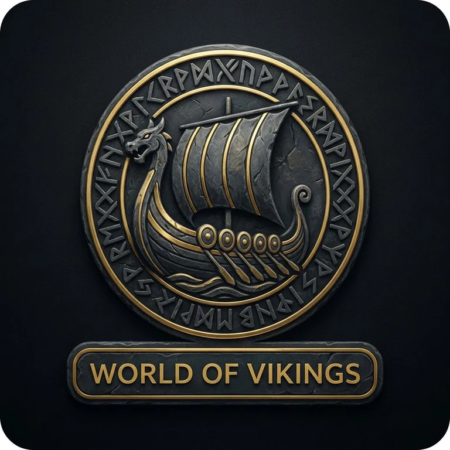
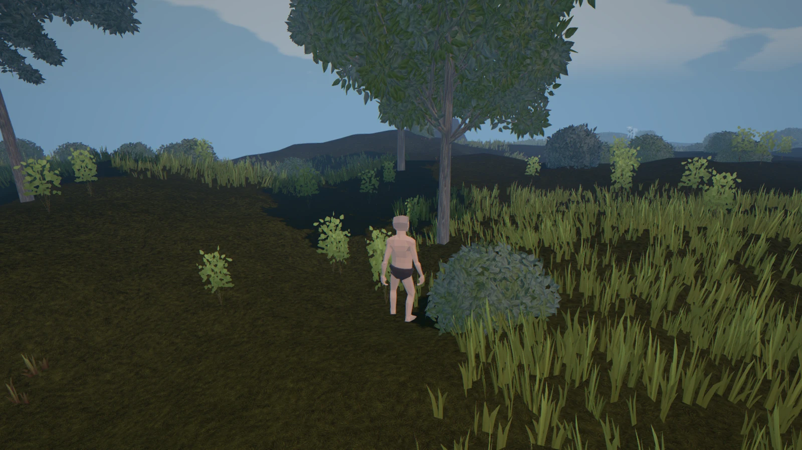
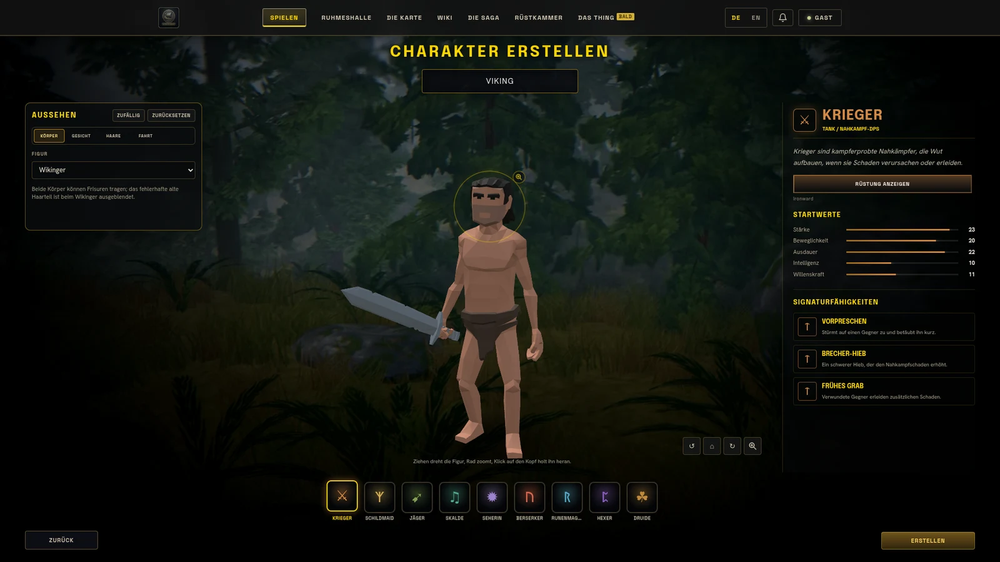

<div align="center">



# World of Vikings

**An online role-playing game about Anglo-Saxons and Vikings that runs in your browser.**<br>
**Ein Online-Rollenspiel um Angelsachsen und Wikinger, das im Browser läuft.**

[](https://github.com/vibe-code-repo/worldofvikings/actions/workflows/ci.yml)


[**▶ Play / Spielen**](https://world-of-mmorpg.com) ·
[🇬🇧 English](#-english) ·
[🇩🇪 Deutsch](#-deutsch) ·
[Developer guide](docs/getting-started.md)



</div>

---

## 🇬🇧 English

World of Vikings is an online role-playing game that you play in your browser.
There is nothing to install: open the page, sign in, and the world loads around
you as you explore it. You start on a small island with a village and set out
from there into meadows, forests and bogs. Along the way you can dig into the
ground, change the terrain and explore dungeons.

The game is in **early access** and is developed in the open. This repository
contains all of it: the game client, the game server, the world editor and the
website.

### Features

- **Runs in the browser.** The game is built on Babylon.js 9 and uses WebGPU,
  with WebGL2 as a fallback for older systems. It has shadows, fog, water and a
  day and night cycle.
- **The server has the final say.** Movement, inventory, crafting, digging and
  loot are all checked on the server, so a modified client cannot cheat.
- **The same world on both sides.** The world is designed in an in-game
  editor. Client and server generate exactly the same terrain from it, and
  tests make sure it stays that way.
- **Terrain you can change.** Dig pits or pile up earth. Your changes stay in
  the world.
- **Dungeons from a seed.** Crypts and caves are generated from a seed. Every
  dungeon is different, but everyone who enters the same one finds the same
  rooms.
- **Your own character.** You create your character on the website with a live
  3D preview and equip armour sets in the game.


<sub>Character creation on the website</sub>

### Running it locally

```bash
git clone https://github.com/vibe-code-repo/worldofvikings.git
cd worldofvikings
npm install
npm run dev
```

This starts the game server, the client and the admin service. Then open
**http://localhost:5274/play/** in your browser and sign in with `guest` /
`guest`. You don't need any credentials or Docker. Models and textures are not
included in the repository. Without them the world still loads, but you won't
see any 3D models.

> [!WARNING]
> A new installation also creates an **admin account with the password
> `admin`**. Before your server is reachable from the internet, set your own
> password with `WOV_ADMINKONTO_PASSWORT` in `/etc/wov.env`. Do this **before
> the first start**, because an account that already exists keeps its password.
> See the [developer guide](docs/getting-started.md#the-admin-account) and
> [`docs/server-setup.md`](docs/server-setup.md) §5a.

The **[developer guide](docs/getting-started.md)** covers ports, commands, the
standard accounts and the architecture. If you want to run a public server with
systemd and nginx, read **[`docs/server-setup.md`](docs/server-setup.md)**.

### Repository layout

```
client/    Babylon.js client, world editor, user interface
server/    game server (TypeScript), decides everything that matters
shared/    world generation, items and network protocol, used by both
admin/     admin service: world document, console, restarts
wov-web/   website (SvelteKit): accounts, map, forum, character creation
tools/     asset pipeline, measurement scripts, world map renderer
Docs/      concepts and design decisions
```

### Contributing

People and AI agents work on the project together. Each task gets its own
branch, its own git worktree and its own pull request. The rules are in
[`AGENTS.md`](AGENTS.md). Before a pull request is reviewed, `typecheck`,
`lint`, `test` and `build` must pass. Pull requests are written in English and
German.

---

## 🇩🇪 Deutsch

World of Vikings ist ein Online-Rollenspiel, das du direkt im Browser spielst.
Installieren musst du nichts: Seite öffnen, anmelden, und die Welt lädt nach,
während du sie erkundest. Du beginnst auf einer kleinen Insel mit einem Dorf und
ziehst von dort hinaus in Wiesen, Wälder und Moore. Unterwegs kannst du graben,
das Gelände verändern und Dungeons erkunden.

Das Spiel ist im **Early Access** und wird öffentlich entwickelt. In diesem
Repository steckt alles: der Spiel-Client, der Spielserver, der Welteditor und
die Webseite.

### Was das Spiel kann

- **Läuft im Browser.** Das Spiel baut auf Babylon.js 9 auf und nutzt WebGPU;
  ältere Systeme bekommen WebGL2. Es gibt Schatten, Nebel, Wasser und einen
  Wechsel von Tag und Nacht.
- **Der Server hat das letzte Wort.** Bewegung, Inventar, Handwerk, Graben und
  Beute prüft der Server. Ein veränderter Client kann deshalb nicht schummeln.
- **Auf beiden Seiten dieselbe Welt.** Die Welt entsteht in einem Editor im
  Spiel. Client und Server berechnen daraus genau dasselbe Gelände, und Tests
  sorgen dafür, dass das so bleibt.
- **Gelände zum Umgraben.** Du kannst Gruben ausheben oder Erde aufschütten.
  Deine Änderungen bleiben in der Welt erhalten.
- **Dungeons aus einem Startwert.** Grüfte und Höhlen werden aus einem Seed
  erzeugt. Jeder Dungeon ist anders, aber wer denselben betritt, findet dieselben
  Räume vor.
- **Deine eigene Figur.** Deine Figur erstellst du auf der Webseite mit einer
  3D-Vorschau, Rüstungssets legst du im Spiel an.


<sub>Charaktererstellung auf der Webseite</sub>

### Lokal starten

```bash
git clone https://github.com/vibe-code-repo/worldofvikings.git
cd worldofvikings
npm install
npm run dev
```

Damit starten Spielserver, Client und Betriebsdienst. Öffne danach
**http://localhost:5274/play/** im Browser und melde dich mit `gast` / `gast`
an. Zugangsdaten oder Docker brauchst du nicht. Modelle und Texturen sind nicht
im Repository enthalten. Ohne sie lädt die Welt trotzdem, du siehst dann aber
keine 3D-Modelle.

> [!WARNING]
> Eine neue Installation legt auch ein **Adminkonto mit dem Passwort `admin`**
> an. Bevor dein Server aus dem Internet erreichbar ist, setze mit
> `WOV_ADMINKONTO_PASSWORT` in `/etc/wov.env` ein eigenes Passwort. Das muss
> **vor dem ersten Start** passieren, denn ein bereits angelegtes Konto behält
> sein Passwort. Mehr dazu im [Entwicklerhandbuch](docs/getting-started.md#the-admin-account)
> und in [`docs/server-setup.md`](docs/server-setup.md) §5a.

Ports, Befehle, die Standardkonten und die Architektur beschreibt das
**[Entwicklerhandbuch](docs/getting-started.md)** (auf Englisch). Wie du einen
öffentlichen Server mit systemd und nginx betreibst, steht in
**[`docs/server-setup.md`](docs/server-setup.md)**.

### Aufbau des Repositorys

```
client/    Babylon.js-Client, Welteditor, Benutzeroberfläche
server/    Spielserver (TypeScript), entscheidet alles Wichtige
shared/    Weltgenerierung, Gegenstände und Netzwerkprotokoll für beide Seiten
admin/     Betriebsdienst: Weltdokument, Konsole, Neustarts
wov-web/   Webseite (SvelteKit): Konten, Karte, Forum, Charaktererstellung
tools/     Asset-Pipeline, Messskripte, Weltkarten-Renderer
Docs/      Konzepte und Designentscheidungen
```

### Mitmachen

Am Projekt arbeiten Menschen und KI-Agenten gemeinsam. Jede Aufgabe bekommt
einen eigenen Branch, einen eigenen Git-Worktree und einen eigenen Pull Request.
Die Regeln stehen in [`AGENTS.md`](AGENTS.md). Bevor ein Pull Request geprüft
wird, müssen `typecheck`, `lint`, `test` und `build` durchlaufen. Pull Requests
schreiben wir auf Englisch und Deutsch.

---

<div align="center">
<sub><a href="https://world-of-mmorpg.com">world-of-mmorpg.com</a></sub>
</div>
