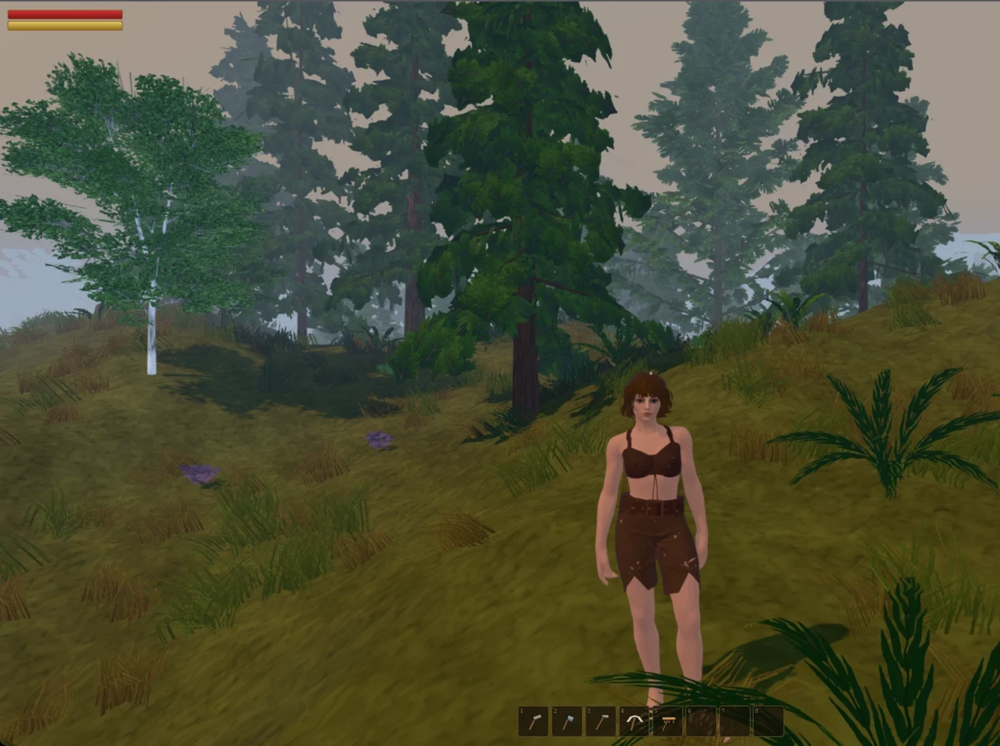
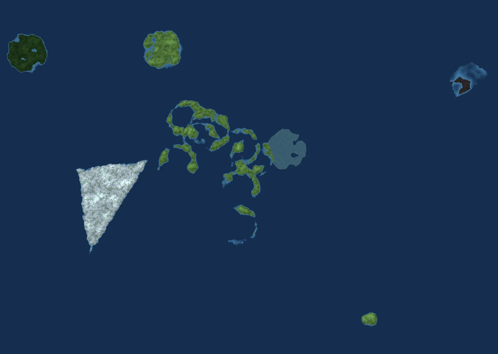
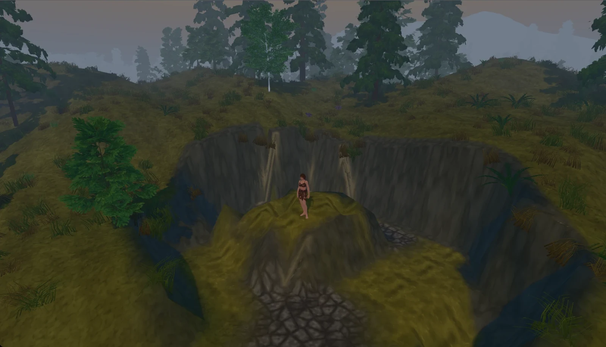
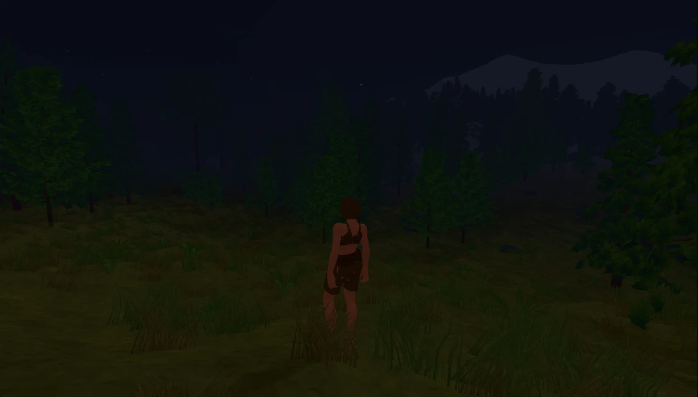
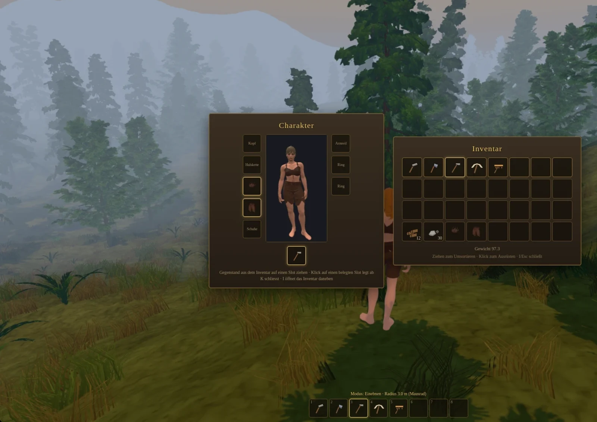

<div align="center">


# World of Vikings

**Anglo-Saxons against Vikings: a multiplayer world that runs in your browser.**<br>
**Angelsachsen gegen Wikinger: eine Mehrspielerwelt, die im Browser läuft.**

[](https://github.com/vibe-code-repo/worldofvikings/actions/workflows/ci.yml)


[**▶ Play / Spielen**](https://world-of-vikings.com) ·
[🇬🇧 English](#-english) ·
[🇩🇪 Deutsch](#-deutsch) ·
[Developer guide](docs/getting-started.md)



</div>

---

## 🇬🇧 English

World of Vikings is an online role-playing game that needs nothing but a browser. No
launcher, no multi-gigabyte download: open the page, sign in, and the world streams in
around you as you walk. Meadows, dark forest and bog, day and night, terrain you can dig
into and dungeons that are built from a seed.

The game is in **early access**. The world is being built in the open, and this
repository is the whole of it: game client, game server, world editor and website.

### What makes it different

| | |
|---|---|
| 🌍 **A world that is written, not rolled** | An in-game editor describes the world as regions with a biome each. Client and server compute the same terrain from it, bit for bit, and golden tests keep it that way. |
| ⚔️ **An honest server** | Movement, inventory, crafting, terraforming and loot are decided by the server. The client draws and asks; it never asserts. |
| ⛏️ **Terrain you can change** | Dig a pit, raise a mound. The ground keeps its shape and shows its cut faces. |
| 🏰 **Dungeons from a seed** | Crypts and caves come from a generator with real doors and room chains: different every time, the same for everyone. |
| 🎨 **Modern rendering** | Babylon.js 9 on WebGPU, with WebGL2 as the fallback. Cascaded shadows, fog, water and a full day and night cycle. |
| 🛡️ **Your own hero** | Create a character on the website with a live 3D preview, then gear up in sets of armour. |

### Screenshots

<table>
  <tr>
    <td width="50%"><br><sub><b>The world map</b>, rendered from the same data the server runs</sub></td>
    <td width="50%"><br><sub><b>Terraforming</b>: a pit dug into the hillside</sub></td>
  </tr>
  <tr>
    <td width="50%"><br><sub><b>Night</b> falls over the same valley</sub></td>
    <td width="50%"><br><sub><b>Character creation</b> with a live 3D preview</sub></td>
  </tr>
  <tr>
    <td colspan="2"><br><sub><b>Character and inventory</b></sub></td>
  </tr>
</table>

### Run it yourself

```bash
git clone https://github.com/vibe-code-repo/worldofvikings.git
cd worldofvikings
npm install
npm run dev
```

That starts game server, client and admin service together. Then open
**http://localhost:5274/play/** and sign in as `guest` / `guest`. No credentials, no
Docker. Models and textures are not part of the repository; without them the world
still loads, just without its 3D content.

> [!WARNING]
> A fresh clone also creates an **admin account with the password `admin`**. Before a
> server is reachable from the internet, set `WOV_ADMINKONTO_PASSWORT` in `/etc/wov.env`
> **before the first start**. Details: [developer guide](docs/getting-started.md#the-admin-account)
> and [`docs/server-setup.md`](docs/server-setup.md) §5a.

Ports, commands, the standard accounts and the architecture are in the
**[developer guide](docs/getting-started.md)**. Running a public server with systemd and
nginx is covered in **[`docs/server-setup.md`](docs/server-setup.md)**.

### Under the hood

```
client/    Babylon.js client, world editor, UI           ─┐
server/    authoritative game server (TypeScript)         ├─ one npm workspace
shared/    world generation, items, protocol              │
admin/     ops service: world document, console, restarts ─┘
wov-web/   the website (SvelteKit): accounts, map, forum, character creation
tools/     asset pipeline, measurement scripts, world map renderer
Docs/      concepts and design decisions
```

### Contributing

The project is built by people and AI agents working side by side, each task in its own
git worktree and pull request. The rules for that are in [`AGENTS.md`](AGENTS.md): one
branch per task, paths declared in the PR, and `typecheck`, `lint`, `test` and `build`
green before review. Pull requests are written in English and German.

---

## 🇩🇪 Deutsch

World of Vikings ist ein Online-Rollenspiel, das nichts braucht außer einem Browser. Kein
Launcher, kein Download von mehreren Gigabyte: Seite öffnen, anmelden, und die Welt lädt
sich nach, während du läufst. Wiesen, Schwarzwald und Moor, Tag und Nacht, Gelände, in das
du graben kannst, und Dungeons, die aus einem Seed entstehen.

Das Spiel ist im **Early Access**. Die Welt entsteht öffentlich, und dieses Repository
enthält alles davon: Spiel-Client, Spielserver, Welteditor und Webseite.

### Was es besonders macht

| | |
|---|---|
| 🌍 **Eine Welt, die geschrieben wird, nicht gewürfelt** | Ein Editor im Spiel beschreibt die Welt als Regionen mit je einem Biom. Client und Server berechnen daraus dasselbe Gelände, Bit für Bit, und Golden-Tests halten das fest. |
| ⚔️ **Ein ehrlicher Server** | Bewegung, Inventar, Handwerk, Terraforming und Beute entscheidet der Server. Der Client zeichnet und fragt; er behauptet nie. |
| ⛏️ **Gelände, das sich formen lässt** | Grube ausheben, Hügel aufschütten. Der Boden behält seine Form und zeigt seine Schnittflächen. |
| 🏰 **Dungeons aus einem Seed** | Grüfte und Höhlen kommen aus einem Generator mit echten Türen und Raumketten: jedes Mal anders, für alle gleich. |
| 🎨 **Moderne Grafik** | Babylon.js 9 auf WebGPU, mit WebGL2 als Rückfall. Kaskadenschatten, Nebel, Wasser und ein voller Tag-Nacht-Wechsel. |
| 🛡️ **Dein eigener Recke** | Figur auf der Webseite mit 3D-Vorschau erstellen, dann in Rüstungssets einkleiden. |

### Bilder

<table>
  <tr>
    <td width="50%"><br><sub><b>Die Weltkarte</b>, gerendert aus denselben Daten, mit denen der Server rechnet</sub></td>
    <td width="50%"><br><sub><b>Terraforming</b>: eine Grube im Hang</sub></td>
  </tr>
  <tr>
    <td width="50%"><br><sub><b>Nacht</b> über demselben Tal</sub></td>
    <td width="50%"><br><sub><b>Charaktererstellung</b> mit 3D-Vorschau</sub></td>
  </tr>
  <tr>
    <td colspan="2"><br><sub><b>Charakter und Inventar</b></sub></td>
  </tr>
</table>

### Selbst starten

```bash
git clone https://github.com/vibe-code-repo/worldofvikings.git
cd worldofvikings
npm install
npm run dev
```

Das startet Spielserver, Client und Betriebsdienst zusammen. Danach
**http://localhost:5274/play/** öffnen und mit `gast` / `gast` anmelden. Keine
Zugangsdaten, kein Docker. Modelle und Texturen liegen nicht im Repository; ohne sie lädt
die Welt trotzdem, nur ohne 3D-Inhalte.

> [!WARNING]
> Ein frischer Klon legt auch ein **Adminkonto mit dem Passwort `admin`** an. Bevor ein
> Server aus dem Internet erreichbar ist, `WOV_ADMINKONTO_PASSWORT` in `/etc/wov.env`
> setzen, und zwar **vor dem ersten Start**. Einzelheiten: [Entwicklerhandbuch](docs/getting-started.md#the-admin-account)
> und [`docs/server-setup.md`](docs/server-setup.md) §5a.

Ports, Befehle, die Standardkonten und die Architektur stehen im
**[Entwicklerhandbuch](docs/getting-started.md)** (Englisch). Wie man einen öffentlichen
Server mit systemd und nginx betreibt, steht in **[`docs/server-setup.md`](docs/server-setup.md)**.

### Unter der Haube

```
client/    Babylon.js-Client, Welteditor, Oberfläche      ─┐
server/    autoritativer Spielserver (TypeScript)          ├─ ein npm-Workspace
shared/    Weltgenerierung, Gegenstände, Protokoll         │
admin/     Betriebsdienst: Weltdokument, Konsole, Neustart ─┘
wov-web/   die Webseite (SvelteKit): Konten, Karte, Forum, Charaktererstellung
tools/     Asset-Pipeline, Messskripte, Weltkarten-Renderer
Docs/      Konzepte und Designentscheidungen
```

### Mitmachen

Am Projekt arbeiten Menschen und KI-Agenten Seite an Seite, jede Aufgabe in einem eigenen
Git-Worktree und Pull Request. Die Regeln dafür stehen in [`AGENTS.md`](AGENTS.md): ein
Branch je Aufgabe, die berührten Pfade im PR benannt, und `typecheck`, `lint`, `test` und
`build` grün vor dem Review. Pull Requests werden auf Englisch und Deutsch geschrieben.

---

<div align="center">
<sub>Forged in Midgard · Geschmiedet in Midgard · <a href="https://world-of-vikings.com">world-of-vikings.com</a></sub>
</div>
